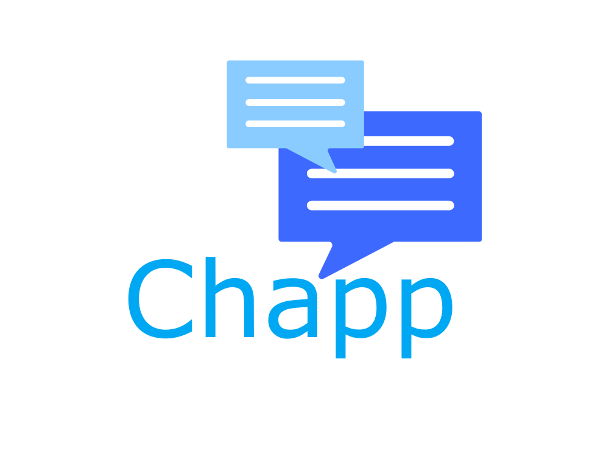
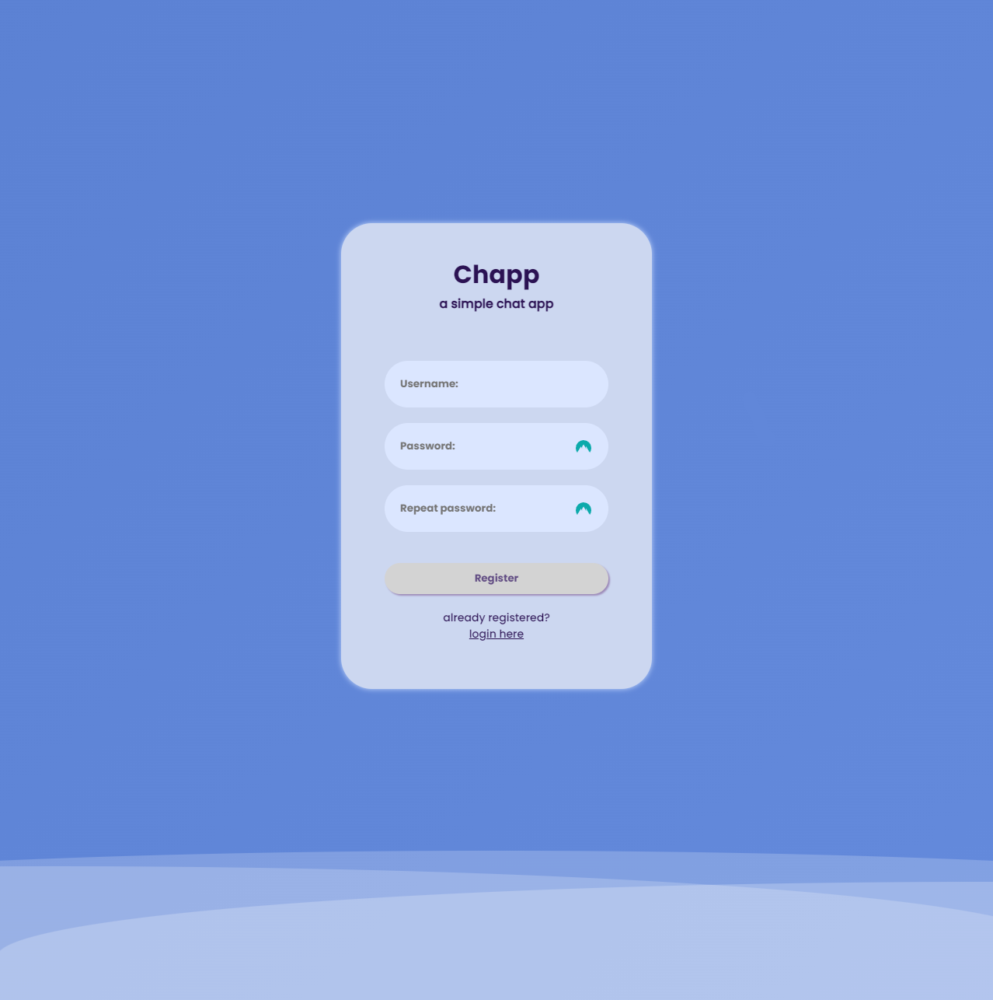
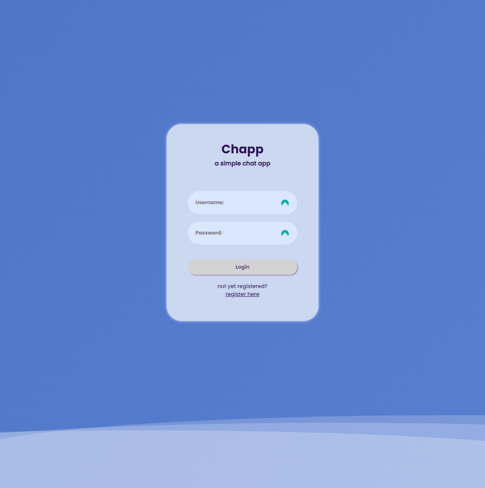
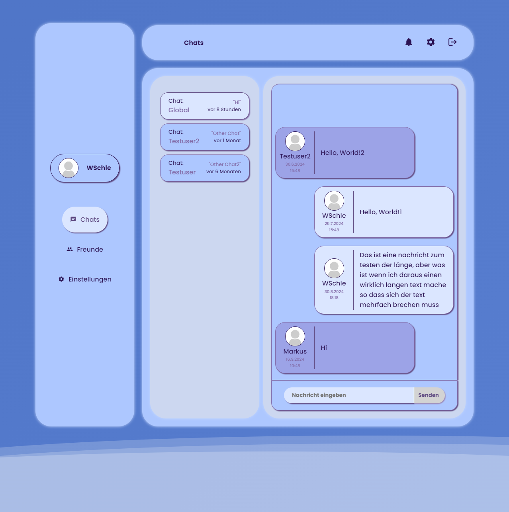

<!-- Improved compatibility of back to top link: See: https://github.com/othneildrew/Best-README-Template/pull/73 -->

<a id="readme-top"></a>

<!--
*** Thanks for checking out the Best-README-Template. If you have a suggestion
*** that would make this better, please fork the repo and create a pull request
*** or simply open an issue with the tag "enhancement".
*** Don't forget to give the project a star!
*** Thanks again! Now go create something AMAZING! :D
-->

<!-- PROJECT SHIELDS -->
<!--
*** I'm using markdown "reference style" links for readability.
*** Reference links are enclosed in brackets [ ] instead of parentheses ( ).
*** See the bottom of this document for the declaration of the reference variables
*** for contributors-url, forks-url, etc. This is an optional, concise syntax you may use.
*** https://www.markdownguide.org/basic-syntax/#reference-style-links
-->

<!-- PROJECT LOGO -->
<br />
<div align="center">
  <a href="https://github.com/WSchle/Chapp">
    
  </a>

<h3 align="center">Chapp</h3>

  <p align="center">
    A simple chat app utilizing sockets and REST API
  </p>
</div>

<!-- TABLE OF CONTENTS -->
<details>
  <summary>Table of Contents</summary>
  <ol>
    <li>
      <a href="#about-the-project">About The Project</a>
      <ul>
        <li><a href="#built-with">Built With</a></li>
      </ul>
    </li>
    <li>
      <a href="#getting-started">Getting Started</a>
      <ul>
        <li><a href="#installation">Installation</a></li>
        <li><a href="#start">Start App</a></li>
      </ul>
    </li>
    <li><a href="#contact">Contact</a></li>
    <li><a href="#acknowledgments">Acknowledgments</a></li>
  </ol>
</details>

<!-- ABOUT THE PROJECT -->

## About Me

Hey there, my name is Willi Schlegel, I am from germany and 26 years old.<br/>
Computers are my passion since my childhood, since I started working on them at an age of 10. <br/>
I started programming at an age of 12 with python and VB, but switched later on to JS and C/C++. <br/>
Up until now I learned everything myself via Youtube/Web Articles/Stackoverflow/Reading other peoples code.<br/>
I have quite a lot to learn still and am looking forward to any constructive critique.

## About The Project

This project is still in development. <br/>
It will certainly contain bugs and or unused code. <br/>
Almost none of the code is optimized in any way yet. <br/>
This project aims for me to learn along the way.<br/>

### Built With

-   [![Next][Next.js]][Next-url]
-   [![React][React.js]][React-url]
-   [![SocketIO][socketio.js]][socketio-url]
-   [![Express][express.js]][express-url]

## Preview

<div style="display:flex; justify-content: space-around">
  <a>
    
  </a>
  <a>
    
  </a>
  <a>
    
  </a>
</div>

<p align="right">(<a href="#readme-top">back to top</a>)</p>

<!-- GETTING STARTED -->

## Getting Started

### Prerequisites

-   MariaDB database with schema:

#### users table:

|      fields      |   type   |
| :--------------: | :------: |
|       uid        |   UUID   |
|     username     |   TEXT   |
|     password     |   TEXT   |
|     friends      | LONGTEXT |
|      chats       |   TEXT   |
|      token       |   TEXT   |
| lastSelectedChat |   TEXT   |

#### messages table:

|  fields   |   type   |
| :-------: | :------: |
|  chatID   |   UUID   |
| senderID  |   UUID   |
| messageID |   UUID   |
|  msgdate  | DATETIME |
|  message  |   TEXT   |

### Installation

1. Clone the repo
    ```sh
    git clone https://github.com/WSchle/Chapp.git
    ```
2. Install NPM packages
    ```sh
    npm install
    ```
3. Change git remote url to avoid accidental pushes to base project
    ```sh
    git remote set-url origin WSchle/Chapp
    git remote -v # confirm the changes
    ```

<!-- START -->

### Start app

1. Navigate into the Chapp folder
2. Run the following commads each in a seperate terminal/console:
    ```sh
    cd ./Client && npm run dev
    cd ./Server && npm run dev
    ```
3. Open "localhost:3000" in your browser

<p align="right">(<a href="#readme-top">back to top</a>)</p>

<!-- USAGE EXAMPLES -->

<!-- ROADMAP -->

## Roadmap

-   [ ] Friends
    -   [ ] Private messages
-   [ ] Notifications
-   [ ] Settings
    -   [ ] Profile settings
    -   [ ] Preference settings

See the [open issues](https://github.com/WSchle/Chapp/issues) for a full list of proposed features (and known issues).

<p align="right">(<a href="#readme-top">back to top</a>)</p>

<!-- LICENSE -->

## License

Distributed under the MIT License. See `LICENSE.txt` for more information.

<p align="right">(<a href="#readme-top">back to top</a>)</p>

<!-- CONTACT -->

## Contact

Willi Schlegel - schlegel.willi@yahoo.com

Project Link: [https://github.com/WSchle/Chapp](https://github.com/WSchle/Chapp)

<p align="right">(<a href="#readme-top">back to top</a>)</p>

<!-- ACKNOWLEDGMENTS -->

## Acknowledgments

-   [W3Schools Docs for css/html/sql](www.w3schools.com)
-   [Devs Mozilla for css/regexp](https://developer.mozilla.org/en-US/docs)
-   [Socket.io Docs for sockets](https://socket.io/docs)
-   [Nextjs Docs for next syntax and function definitions](https://nextjs.org/docs)
-   [Dev.to for express](https://dev.to/)

<p align="right">(<a href="#readme-top">back to top</a>)</p>

<!-- MARKDOWN LINKS & IMAGES -->
<!-- https://www.markdownguide.org/basic-syntax/#reference-style-links -->

[Next.js]: https://img.shields.io/badge/next.js-000000?style=for-the-badge&logo=nextdotjs&logoColor=white
[Next-url]: https://nextjs.org/
[React.js]: https://img.shields.io/badge/React-20232A?style=for-the-badge&logo=react&logoColor=61DAFB
[React-url]: https://reactjs.org/
[socketio.js]: https://img.shields.io/badge/Socket.io-black?style=for-the-badge&logo=socket.io&badgeColor=010101
[socketio-url]: https://socket.io/
[express.js]: https://img.shields.io/badge/express.js-%23404d59.svg?style=for-the-badge&logo=express&logoColor=%2361DAFB
[express-url]: https://expressjs.com/
